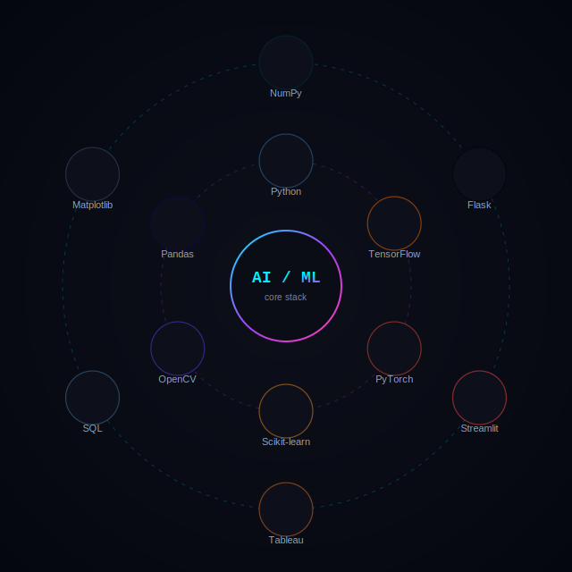

<div align="center">



<br/>

<a href="https://www.linkedin.com/in/vrushikakpanchal"></a>


</div>


<h2 align="left">
 About Me
</h2>

<table>
<tr>
<td width="66%" valign="top">

I design and build **machine learning & deep learning systems** that turn raw data — images, text, tabular records — into working intelligence. My interests sit at the intersection of **Computer Vision**, **Data Science**, and applied ML, where I enjoy the full loop: cleaning messy data, training models, and shipping them as usable apps.

```
class Vrushika:
    def __init__(self):
        self.domain   = ["Computer Vision", "Deep Learning", "Data Science"]
        self.stack    = ["Python", "TensorFlow", "PyTorch", "Scikit-learn"]
        self.mindset  = "models that are accurate AND explainable"

    def currently(self):
        return "training the next idea into a working model"
```

</td>
<td width="34%" align="center">

<sub>core stack — orbiting</sub>
</td>
</tr>
</table>


<h2 align="left">
 Technology Arsenal
</h2>

<div align="center">

**Core Language &nbsp;&nbsp;·&nbsp;&nbsp; Data**


<br/><br/>

**Machine Learning &nbsp;&nbsp;·&nbsp;&nbsp; Deep Learning**


<br/><br/>

**Computer Vision &nbsp;&nbsp;·&nbsp;&nbsp; Data Tools**


<br/><br/>

**Apps &nbsp;&nbsp;·&nbsp;&nbsp; Visualization**


</div>


<h2 align="left">
 Project Showcase
</h2>

<table>
<tr>
<td width="50%"><a href="https://github.com/vrushikakpanchal/Eco-Sense-AI-Powered-Wildlife-Monitoring-System"></a></td>
<td width="50%"><a href="https://github.com/vrushikakpanchal/Fabric_Defect_Detection"></a></td>
</tr>
<tr>
<td width="50%"><a href="https://github.com/vrushikakpanchal/Inkwell-Narrative-Intelligence"></a></td>
<td width="50%"><a href="https://github.com/vrushikakpanchal/Indian-Tourism---Astra_Nova"></a></td>
</tr>
</table>

<div align="center">
<a href="https://github.com/vrushikakpanchal/GrocerGenius_AI_Based_Supermarket_Sales_Prediction_Infosys_Internship_Oct2024"></a>
</div>


<h2 align="left">
 Research Interests
</h2>

<table>
<tr>
<td align="center" width="25%">🧬<br/><sub><b>Transformer<br/>Architectures</b></sub></td>
<td align="center" width="25%">👁️<br/><sub><b>Advanced<br/>Computer Vision</b></sub></td>
<td align="center" width="25%">🌐<br/><sub><b>Deploying ML<br/>as Web Apps</b></sub></td>
<td align="center" width="25%">📊<br/><sub><b>Storytelling with<br/>Tableau</b></sub></td>
</tr>
</table>


<h2 align="left">
 GitHub Analytics
</h2>

<div align="center">


<br/><br/>


</div>

<br/>

<div align="center">

<h2 align="left">
 Contribution Graph
</h2>


</div>

<!--
  Snake contribution animation:
  Add the GitHub Action from Platane/snk to your profile repo,
  then uncomment the line below once the generated snake.svg is live.

  
-->


<div align="center">

<a href="https://www.linkedin.com/in/vrushikakpanchal"></a>
&nbsp;&nbsp;


<br/>


</div>
